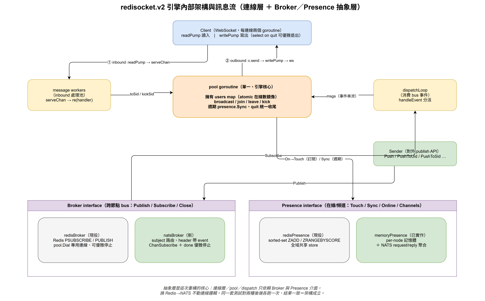

# redisocket.v2 architecture

> 🌐 **English** · [繁體中文](ARCHITECTURE.zh-TW.md)

redisocket.v2 is the WebSocket hub engine behind gusher.cluster. It holds ws
connections and fans out messages, with the cross-node **bus** and **presence**
behind pluggable interfaces — a Redis implementation and a NATS implementation,
swappable without touching the connection layer.

> Diagram sources are the `.drawio` files in `diagrams/` — open them in draw.io
> to edit.

## Engine internals

Three layers:

- **Connection layer** — per ws connection: a `readPump` (inbound) and
  `writePump` (outbound, selects on `quit` to exit cleanly). Inbound messages
  pass through a configurable worker pool (`messageQuene`).
- **pool goroutine** — the single owner of the `users` map; handles
  broadcast / join / leave / kick, periodic `presence.Sync`, and shutdown via a
  `quit` channel. All sends to a client *and* its close are serialized here, so
  there is no send-on-closed-channel race.
- **Abstraction layer** — `dispatchLoop` consumes `Broker.Subscribe()`;
  `Sender` publishes via `Broker.Publish()`; presence goes through the
  `Presence` interface. The connection/pool/dispatch code never names a backend.

## Broker (cross-node bus)

`Broker`: `Publish(prefix, appKey, event, data)`,
`Subscribe(prefix) → (events, errors)`, `Close()`.

- **redisBroker** — Redis `PUBLISH` / `PSUBSCRIBE`. Uses a dedicated
  `pool.Dial()` connection (not a pooled one) so `Close` can interrupt the
  blocking `Receive` race-free.
- **natsBroker** — NATS subject `<prefix>ch.<appKey>`; the event name rides in a
  message **header**, the data in the **body** (no encoding — channel names with
  `.` or special chars are safe). `ChanSubscribe` + a `done` channel for clean
  shutdown.
- The receive side is uniform: `dispatchLoop` gets a `BrokerEvent{appKey, event,
  data}` → `handleEvent` (the `#GUSHERFUNC-*#` control events, else a channel
  broadcast).

## Presence

`Presence`: `Touch`, `Sync` (bulk snapshot), `Online` / `OnlineByChannel` /
`Channels`, `Close`.

- **redisPresence** — sorted sets (`ZADD` score=timestamp, `ZRANGEBYSCORE`,
  periodic `ZREMRANGEBYSCORE`). A shared global store; strongly consistent.
- **memoryPresence** — per-node in-memory state; cross-node queries via NATS
  **request/reply** scatter-gather (each node answers for its own connections,
  results are merged). No store, no `KEYS`. Eventually consistent (queried
  live) — the better fit at 100k+ connections.

## Graceful shutdown

`Hub.Close()` (idempotent) closes the `quit` channel and the broker. `pool.run`,
the message workers, `statistic.Run`, every client `writePump`, and the broker
subscription all exit; `go.uber.org/goleak` verifies **zero leaked goroutines**.

## Testing

The same behaviour suite runs against three backends — **redis** (miniredis),
**nats** (embedded `nats-server`), and **nats-native** (natsBroker +
memoryPresence, zero Redis) — all under `-race`, fully in-process (no Docker).
It also covers cross-node presence aggregation, dotted-channel subject mapping,
and `goleak`.

## See also

- [gusher.cluster ARCHITECTURE](https://github.com/syhlion/gusher.cluster/blob/master/docs/ARCHITECTURE.md)
  — the system that embeds this engine
- `logger.go` — opt-in `NewLogger`: output **stdout / file / both** + log
  rotation (lumberjack); the engine itself only takes a `*slog.Logger`
